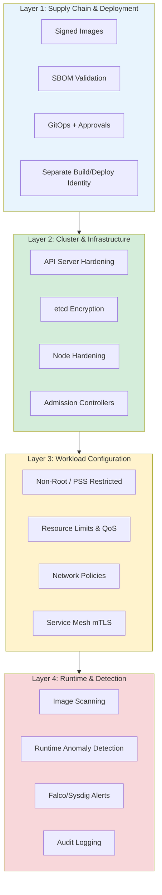
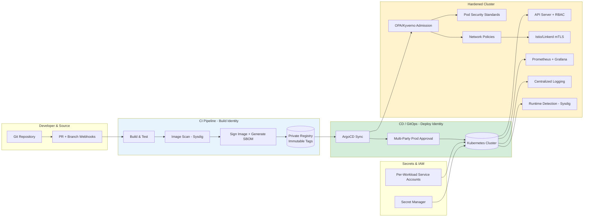
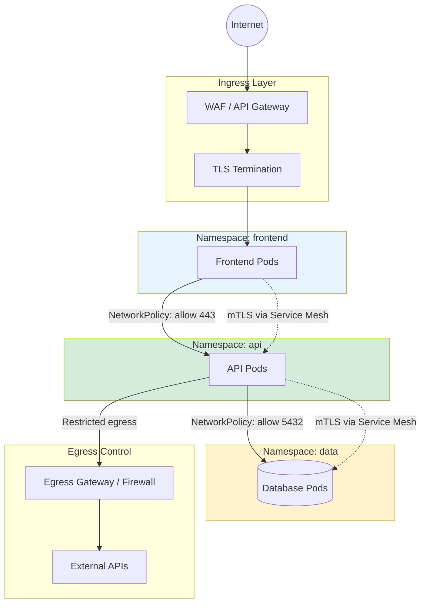
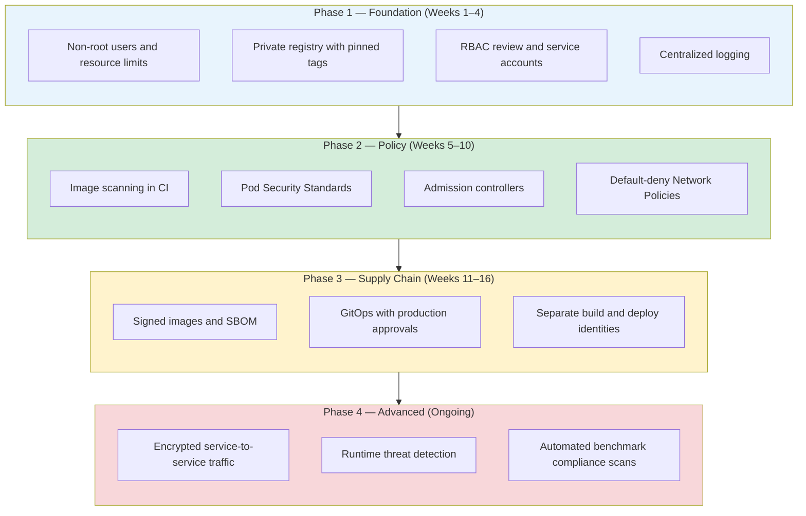
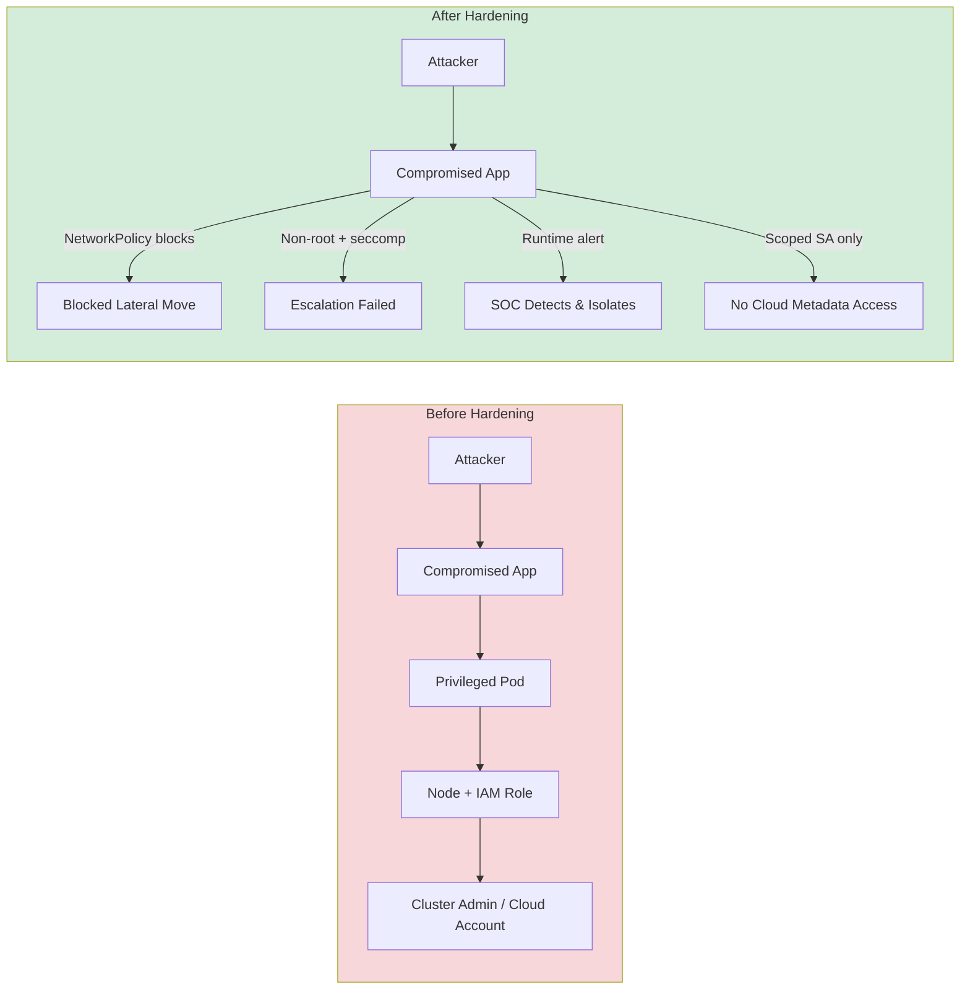

## Why Container Security Matters

### The Illusion of Isolation

Containers share a kernel. Unlike virtual machines, they are not hard boundaries they are namespaced processes with optional control group limits and Linux security modules layered on top. When we treat containers like as "VMs," and think it inherit controls like VMs such as internal traffic is trusted, root inside the container is harmless this does not satisfies in Kubernetes. 

### The Blast Radius Has Changed Shape

In a monolithic datacenter architecture, compromise might mean one server. But in Kubernetes:

- **One privileged pod** can read host filesystems, access cloud metadata APIs, or pivot to the node IAM role.
- **One poisoned image** in CI can deploy to every environment that trusts the pipeline.
- **One missing NetworkPolicy** can leave the entire cluster open to internal reconnaissance between microservices.

### Compliance and Customer Trust

Regulators and auditors expect evidence that production workloads are built from verified artifacts, run with least privilege, encrypt sensitive data, and leave an audit trail when configurations change. Frameworks such as SOC 2, ISO 27001, HIPAA, and PCI DSS all map to concrete Kubernetes practices: signed images and SBOMs for supply chain integrity, RBAC and secret management for access control, NetworkPolicies for segmentation, and centralized logging for monitoring and incident response. Below are basic controls that auditors might ask evidence for: 

- Signature verification logs at deploy time
- SBOM + vulnerability scan reports per release
- Least-privilege RBAC and secret handling
- Use of non-root user and no privileged pods
- Kubernetes audit logs for who changed cluster resources and when
- Scan report that align with CIS Benchmarks and Pod Security Standards

### Cost of Getting It Wrong

| Missing Controls            | Typical Impact                               |
| --------------------------- | -------------------------------------------- |
| Root + privileged pod       | Node compromise, cluster takeover            |
| `:latest` tag in production | Uncontrolled rollbacks, unknown CVE exposure |
| Secrets in ConfigMaps       | Credential theft, data exfiltration          |
| No network segmentation     | Lateral movement after initial foothold      |
| Weak CI/CD identity         | Supply chain compromise at scale             |

## Defense in Depth: How the Control Domains Fit Together

The security controls below are not separate items to pick and choose from. They work together like layers of one system.

## Secure Reference Architecture

The following diagram illustrates a production-grade secure container platform. 

Internal cluster traffic is not automatically secure. Network Policies and service mesh mTLS enforce identity-aware communication.

---

## Why Golden Images Matter

A **golden image** is a pre-approved, minimal base image that every team builds from instead of pulling random public images ad hoc. Think of it as the standard front door every application must use—same locks, same thickness, same inspection before anyone moves in.

**Why security teams care:**

- **Smaller attack surface** — A slim base image contains fewer packages, which means fewer known vulnerabilities to patch and fewer places for attackers to hide tools.
- **Consistent hardening** — Non-root user, dropped capabilities, and security patches are applied once in the golden image, not reimplemented (or forgotten) by every development team.
- **Faster, reliable scanning** — When all apps share a known base, vulnerability scans are repeatable. You scan the golden image and every app built on top of it inherits that baseline.
- **Audit and compliance** — Auditors can review one approved image pipeline instead of hundreds of one-off Dockerfiles. You can show exactly what is allowed to run in production.
- **Supply chain control** — Only blessed images from your private registry get deployed. Unknown or tampered public images never reach the cluster.

Without golden images, every team ships a slightly different container. Some run as root, some include debug tools, some never get patched. Golden images turn container security from a per-app negotiation into a **platform default**.

---

## Domain-by-Domain Analysis

### 1. Container Runtime Security

**Goal:** Limit the damage if a container is compromised.

| Control | Why it matters |
| -------- | -------------- |
| **Run as non-root** | Running as root inside a container makes it easier to break out to the host. Use a regular user by default. |
| **Golden images (minimal base)** | Start from a small, approved base image. Fewer packages means fewer vulnerabilities and easier patching. |
| **Regular image scanning** | Scan images in CI before deploy. Rescan when new vulnerabilities are published—risk changes over time. |
| **Drop unused Linux capabilities** | Extra permissions (like raw network access or admin powers) help attackers. Remove all extras; add back only what the app needs. |
| **Restrict privileged mode** | Privileged containers bypass most isolation. Allow only in rare cases with formal approval. |
| **Immutable container filesystems** | Stop attackers from writing malware or backdoors into the container. Use temporary volumes for data that must be writable. |
| **Block hostPath unless approved** | Mounting host folders into a pod can expose the entire node. Block by default; allow only with approval. |
| **Restrict system calls (seccomp)** | Limit which kernel calls a container can make. This reduces ways to exploit the host. |

### 2. Application Health & Resilience

**Goal:** Keep apps healthy so broken or stuck containers do not become easy targets.

| Control | Why it matters |
| -------- | -------------- |
| **Readiness and liveness probes** | Do not send traffic to pods that are not ready. Restart pods that are stuck or failing before they cause outages or security gaps. |
| **Health and performance checks** | Slow or failing apps are easier to attack. Regular checks catch problems early. |
| **Graceful shutdown hooks** | Shut down apps cleanly during updates so connections and data are not left in a broken state. |
| **Node taints and tolerations** | Run sensitive workloads on dedicated nodes, separate from general workloads. |

### 3. Resource Management & Reliability

**Goal:** Stop one workload from consuming all CPU or memory and affecting others.

| Control | Why it matters |
| -------- | -------------- |
| **CPU and memory limits** | Without limits, one pod can crash neighbors or starve the node. Set limits on every workload. |
| **Spread workloads across nodes** | Do not put all copies of an app on one node. Spreading them limits damage if a single node fails or is compromised. |

---

### 4. Observability & Monitoring

**Goal:** See what is happening before and during an incident. Containers disappear when they restart—logs must be collected centrally.

| Control | Why it matters |
| -------- | -------------- |
| **Centralized logging** | Store logs from all pods and cluster components in one place for investigation and compliance. |
| **Monitoring and alerting** | Alert on unusual CPU use, repeated restarts, failed logins, and blocked deployments—not just disk space. |
| **Control plane monitoring** | Watch cluster health (API server, database, scheduler). Problems there often appear before security incidents. |

---

### 5. Secure Supply Chain & Deployment

**Goal:** Protect the build and deploy pipeline. If an attacker compromises CI, they can push malicious code to production.

| Control | Why it matters |
| -------- | -------------- |
| **GitOps-based deployment** | Deploy only from approved Git changes. Every production change is visible, reviewable, and reversible. |
| **Branch-specific CI/CD triggers** | Only the main branch should deploy to production. Feature branches must not reach prod by accident. |
| **Signed images** | Verify that images came from your trusted build system and were not altered in transit. |
| **SBOM generation and validation** | Maintain a list of everything inside each image so you can respond quickly when a new vulnerability is announced. |
| **Immutable tags (avoid `:latest`)** | Pin a specific version or digest. `:latest` makes rollbacks and audits unreliable. |
| **Separate build and deploy accounts** | The build pipeline can create images but cannot deploy them. The deploy pipeline can deploy but cannot build. Stolen credentials do less damage. |
| **Multi-party approval for production** | Require a second reviewer or approval step before anything reaches production. |

### 6. Identity & Access Management

**Goal:** Give people and apps only the access they need—nothing more.

| Control | Why it matters |
| -------- | -------------- |
| **Per-workload service accounts** | Do not share one cloud identity across all pods on a node. Each app should have its own limited account. |
| **Regular RBAC reviews** | Over time, people accumulate too many permissions. Review access regularly and remove what is not needed. |
| **Secrets from a secret store** | Never put passwords or API keys in code or images. Pull them from a managed secret store at runtime. |
| **Encrypt secrets at rest** | Cluster backups contain secrets. Encrypt them using keys managed by your cloud provider or key management service. |
| **Automatic secret rotation** | Change passwords and keys on a schedule. Old credentials should not stay valid forever. |

---

### 7. Advanced Security Controls

**Goal:** Add extra protection at the operating system level for high-risk environments.

| Control | Why it matters |
| -------- | -------------- |
| **Mandatory access controls** | Use kernel security modules to restrict what processes can do, even if they gain elevated privileges. |
| **Rootless containers** | Map container root to a non-privileged user on the host so breaking out is much harder. |
| **Automated kernel and node patching** | Attackers exploit old kernel bugs to escape containers. Keep nodes updated on a regular schedule. |

---

### 8. Network Security

**Goal:** Assume an attacker may already be inside the cluster. Limit how far they can move and what they can reach.

| Control | Why it matters |
| -------- | -------------- |
| **Network Policies** | Block all traffic by default between apps. Allow only the specific connections each app needs. |
| **Encrypted service-to-service traffic** | Use a service mesh or similar to encrypt traffic between apps and verify each caller's identity. |
| **Restrict outbound traffic** | Stop compromised apps from sending data to the internet or calling unknown external services. |
| **Secure ingress (TLS, WAF, API gateway)** | Encrypt traffic from users, block common web attacks, and rate-limit abusive requests at the edge. |

---

### 9. Runtime Security

**Goal:** Catch attacks that happen while containers are running, after they have already been deployed.

| Control | Why it matters |
| -------- | -------------- |
| **Continuous vulnerability scanning** | Rescan running workloads when new vulnerabilities are discovered. |
| **Filesystem integrity checks** | Detect when unknown files or changes appear inside a container. |
| **Read-only root filesystem** | Prevent attackers from installing backdoors or tools after they get in. |
| **Runtime anomaly detection** | Alert when unusual behavior occurs—such as a shell opening in production or unexpected outbound connections. |
| **Host isolation** | Do not share the host's process list, network, or IPC with containers. It weakens isolation. |

---

### 10. Compliance & Governance

**Goal:** Turn security rules into automated checks so they apply consistently as the cluster grows.

| Control | Why it matters |
| -------- | -------------- |
| **Industry benchmarks (CIS)** | Follow published security baselines for Kubernetes and containers. Run regular compliance scans. |
| **Pod Security Standards** | Use built-in Kubernetes security profiles. Move workloads toward the strictest profile over time. |
| **Admission controllers** | Block unsafe deployments automatically—privileged pods, unapproved images, missing resource limits. |
| **Ongoing policy enforcement** | Rules on paper are not enough. Enforce them at deploy time and audit exceptions regularly. |
| **Audit logging** | Record who changed what in the cluster. Required for compliance and incident investigations. |

---

### 11. Infrastructure & Cluster Security

**Goal:** Protect the cluster itself—the nodes, control plane, and core services that run everything else.

| Control | Why it matters |
| -------- | -------------- |
| **Node hardening** | Close unused ports and remove unnecessary services on every node. |
| **Secure the cluster database (etcd)** | This stores all cluster secrets and configuration. Require encryption, authentication, and restricted access. |
| **Harden the API server** | Disable anonymous access, turn off insecure endpoints, and enable audit logging. |
| **Regular cluster upgrades** | Outdated Kubernetes versions have known vulnerabilities. Patch on a planned schedule. |
| **Block cloud metadata access from pods** | Stop apps from reaching the cloud provider's metadata service unless explicitly needed. Attackers use it to steal cloud credentials. |

---

## Implementation Roadmap

Prioritize controls by **risk reduction vs effort**. The phased approach below mirrors what most security engineering teams deploy successfully.

### Phase 1 — Quick Wins (Weeks 1–4)

- Enforce non-root, drop capabilities, read-only root FS where feasible
- Eliminate `:latest`; pin image digests
- Define CPU/memory limits on all workloads
- Enable centralized logging and basic monitoring alerts
- Audit RBAC; remove broad admin access where possible

### Phase 2 — Policy Enforcement (Weeks 5–10)

- Deploy admission policies to block privileged pods and unapproved registries
- Adopt Pod Security Standards (`restricted` for new workloads)
- Implement default-deny NetworkPolicies per namespace
- Integrate image scanning in CI

### Phase 3 — Supply Chain Integrity (Weeks 11–16)

- Sign images; verify signatures at admission
- Generate and store SBOMs per release
- Use GitOps with branch protections and production approval workflows
- Split CI build identity from CD deploy identity

### Phase 4 — Runtime & Zero Trust (Ongoing)

- Encrypt service-to-service traffic for sensitive tiers
- Runtime anomaly detection and automated response playbooks
- Continuous benchmark compliance scanning
- Secret rotation automation

---

## Threat Model: Before and After Hardening

---

## Conclusion

Container security is not a single tool. It is architecture, process, and culture expressed through enforceable controls. The checklist your organization is implementing spans runtime isolation, resilient operations, observability, supply chain integrity, identity, network zero trust, runtime detection, governance, and platform hardening. Each domain reinforces the others.

As a security engineer, my advice is direct: start with what attackers exploit first privileged pods, public images, missing network segmentation, and over-permissioned CI/CD and automate denial of bad configurations at admission time. Scanning and monitoring catch what policy misses.

Build golden paths for developers so the secure choice is the easy choice. A hardened cluster that blocks every deployment without guidance will be bypassed; a hardened cluster with documented patterns, GitOps workflows, and sensible defaults will be defended.

