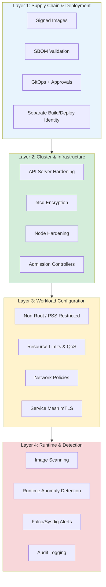
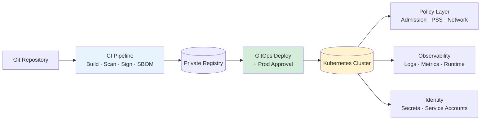
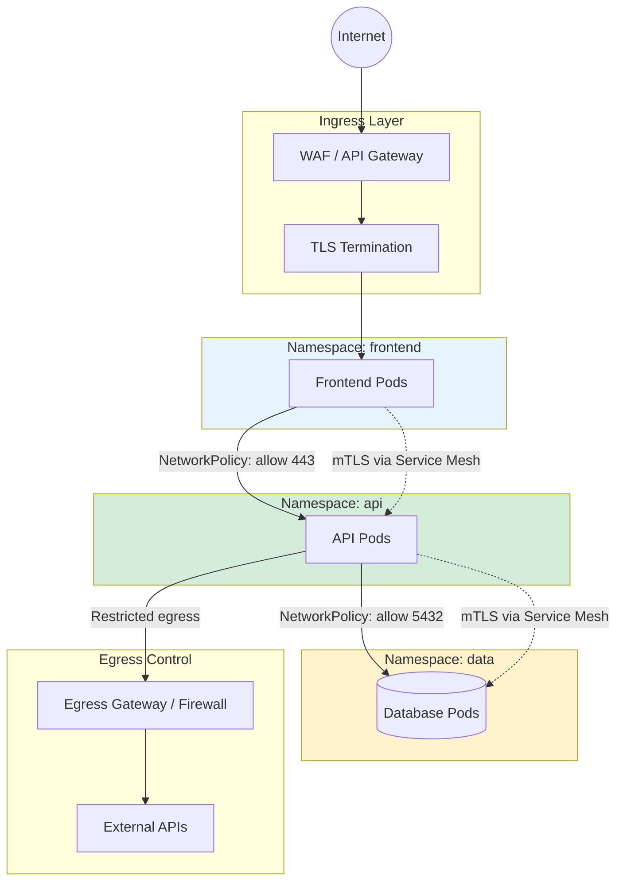
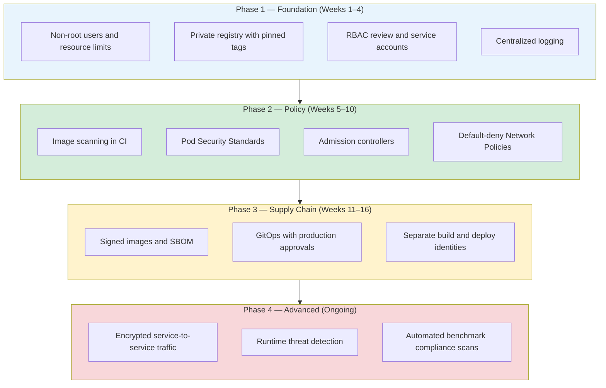
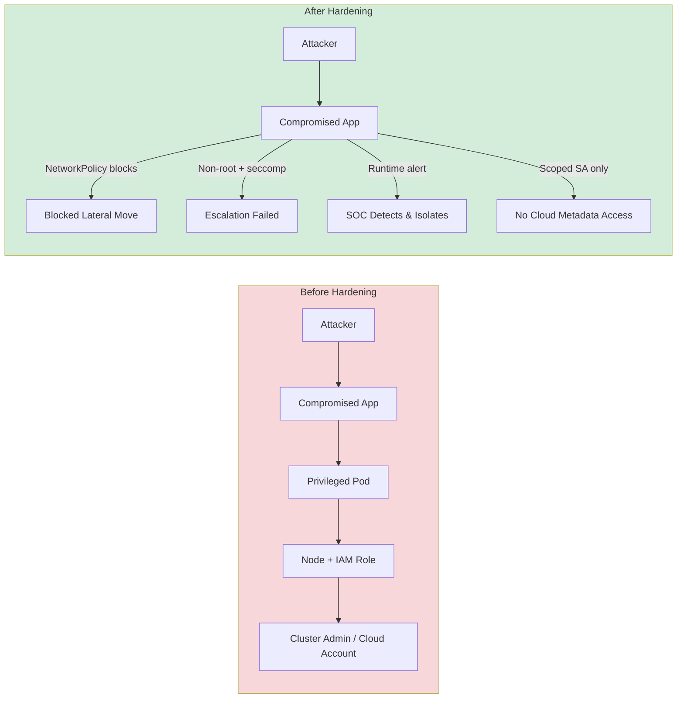

## Why Container Security Matters

### The Illusion of Isolation

Containers share a kernel. Unlike virtual machines, they are not hard boundaries they are namespaced processes with optional control group limits and Linux security modules layered on top. When we treat containers like as "VMs," and think it inherit controls like VMs such as internal traffic is trusted, root inside the container is harmless this does not satisfies in Kubernetes. 

### The Blast Radius Has Changed Shape

In a monolithic datacenter architecture, compromise might mean one server. But in Kubernetes:

- **One privileged pod** can read host filesystems, access cloud metadata APIs, or pivot to the node IAM role.
- **One poisoned image** in CI can deploy to every environment that trusts the pipeline.
- **One missing NetworkPolicy** can leave the entire cluster open to internal reconnaissance between microservices.

### Compliance and Customer Trust

Regulators and auditors expect evidence that production workloads are built from verified artifacts, run with least privilege, encrypt sensitive data, and leave an audit trail when configurations change. Frameworks such as SOC 2, ISO 27001, HIPAA, and PCI DSS all map to concrete Kubernetes practices: signed images and SBOMs for supply chain integrity, RBAC and secret management for access control, NetworkPolicies for segmentation, and centralized logging for monitoring and incident response. Below are basic controls that auditors might ask evidence for: 

- Signature verification logs at deploy time
- SBOM + vulnerability scan reports per release
- Least-privilege RBAC and secret handling
- Use of non-root user and no privileged pods
- Kubernetes audit logs for who changed cluster resources and when
- Scan report that align with CIS Benchmarks and Pod Security Standards

### Cost of Getting It Wrong

| Missing Controls            | Typical Impact                               |
| --------------------------- | -------------------------------------------- |
| Root + privileged pod       | Node compromise, cluster takeover            |
| `:latest` tag in production | Uncontrolled rollbacks, unknown CVE exposure |
| Secrets in ConfigMaps       | Credential theft, data exfiltration          |
| No network segmentation     | Lateral movement after initial foothold      |
| Weak CI/CD identity         | Supply chain compromise at scale             |

## Defense in Depth: How the Control Domains Fit Together

The security controls below are not separate items to pick and choose from. They work together like layers of one system.

## Secure Reference Architecture

The following diagram illustrates a production-grade secure container platform. 

Internal cluster traffic is not automatically secure. Network Policies and service mesh mTLS enforce identity-aware communication.

---

## Why Golden Images Matter

A golden image is a pre-approved, minimal base image that every team should builds instead of pulling random public images. Think of it as the standard front door every application must use—same locks, same thickness, same inspection before anyone moves in.

**Why security teams care:**

- **Smaller attack surface** — A slim base image contains fewer packages, which means fewer known vulnerabilities to patch and fewer places for attackers to hide tools.
- **Consistent hardening** — Non-root user, dropped capabilities, and security patches are applied once in the golden image, not reimplemented (or forgotten) by every development team.
- **Faster, reliable scanning** — When all apps share a known base, vulnerability scans are repeatable. You scan the golden image and every app built on top of it inherits that baseline.
- **Audit and compliance** — Auditors can review one approved image pipeline instead of hundreds of one-off Dockerfiles. You can show exactly what is allowed to run in production.
- **Supply chain control** — Only blessed images from your private registry get deployed. Unknown or tampered public images never reach the cluster.

## Implementation Roadmap

Prioritize controls by **risk reduction vs effort**. The phased approach below mirrors what most security engineering teams deploy successfully.

### Phase 1 — Quick Wins (Weeks 1–4)

- Enforce non-root, drop capabilities, read-only root FS where feasible
- Eliminate `:latest`; pin image digests
- Define CPU/memory limits on all workloads
- Enable centralized logging and basic monitoring alerts
- Audit RBAC; remove broad admin access where possible

### Phase 2 — Policy Enforcement (Weeks 5–10)

- Deploy admission policies to block privileged pods and unapproved registries
- Adopt Pod Security Standards (`restricted` for new workloads)
- Implement default-deny NetworkPolicies per namespace
- Integrate image scanning in CI

### Phase 3 — Supply Chain Integrity (Weeks 11–16)

- Sign images; verify signatures at admission
- Generate and store SBOMs per release
- Use GitOps with branch protections and production approval workflows
- Split CI build identity from CD deploy identity

### Phase 4 — Runtime & Zero Trust (Ongoing)

- Encrypt service-to-service traffic for sensitive tiers
- Runtime anomaly detection and automated response playbooks
- Continuous benchmark compliance scanning
- Secret rotation automation

---

## Threat Model: Before and After Hardening

---

## Conclusion

Container security is not a single tool. It is architecture, process, and culture expressed through enforceable controls. The checklist your organization is implementing spans runtime isolation, resilient operations, observability, supply chain integrity, identity, network zero trust, runtime detection, governance, and platform hardening. Each domain reinforces the others.

As a security engineer, my advice is direct: start with what attackers exploit first privileged pods, public images, missing network segmentation, and over-permissioned CI/CD and automate denial of bad configurations at admission time. Scanning and monitoring catch what policy misses.

Build golden paths for developers so the secure choice is the easy choice. A hardened cluster that blocks every deployment without guidance will be bypassed; a hardened cluster with documented patterns, GitOps workflows, and sensible defaults will be defended.

